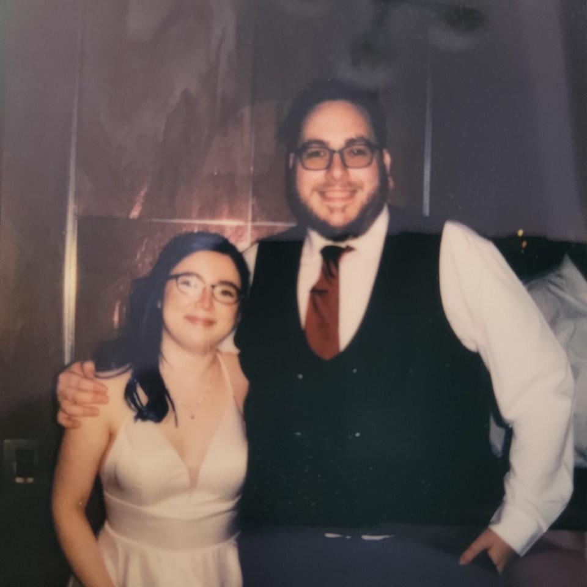

# Daniel S Callegari

## Where I'm From
I'm an Illinois native, born and raised in the Chicago suburb of Berwyn. I still live there after moving twice but this will hopefully change post-graduation.

## First Computing Device
My first computing device was a COMPAQ desktop running Windows 98 I beleieve. It was a family PC that was given to us by a friend of the family back in the day.

## IT Interests
I currently work as a full-time infrastructure support technician for Follett and love working with computing technology as a whole. I hope to move to a more hands-on position post graduation at Follett or for another company.

In regards to actual interests, I love taking apart and assembling computers, network setups, and overall IT work. I also dabble in game design and music theory, but not as much as I do IT work. 

## Something Interesting About You
I used to take part in Tae-Kwon-Do and would participate in tournaments in the mid-2000's. The highest rank I reached was 1st-degree black belt. (I  may one day return and try for a further belt, but it is not a priority.)